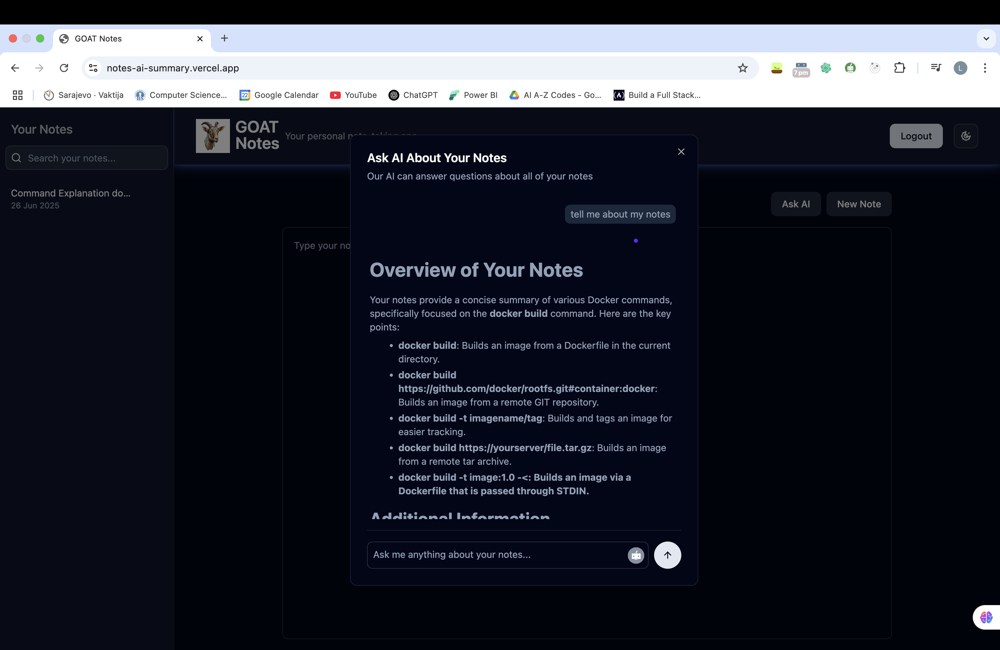

# 📝 notes‑ai‑summary

An AI‑powered tool that summarizes and queries your personal notes with ease. Built on Next.js, Supabase, and OpenAI, it's the perfect companion for anyone looking to quickly make sense of their note collection.

---



## 🚀 Features

- **Ask AI about your notes** — Chat interface to ask questions and get summaries across all your notes  
- **Auto‑expanding textarea** — The input box grows as long as your question  
- **Async, streaming responses** — Submit questions and get instant feedback while thinking  
- **Auth & data storage** — Secure login with Supabase; notes and chat history saved in your database

---

## 🧱 Tech Stack 🔧

| Layer            | Technology               |
|------------------|--------------------------|
| Frontend         | Next.js (app router)     |
| Authentication   | Supabase Auth            |
| Database         | Supabase Postgres        |
| AI Integration   | OpenAI API               |
| UI Components    | shadcn-ui, lucide-react  |
| Styling          | Tailwind CSS             |

---

## 📦 Installation & Setup

1. **Clone the repo:**
   ```bash
   git clone https://github.com/leejlaa/notes‑ai‑summary.git
   cd notes‑ai‑summary
